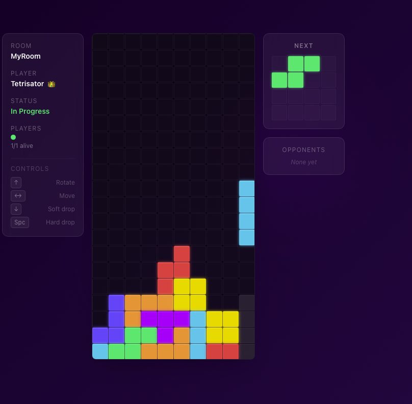
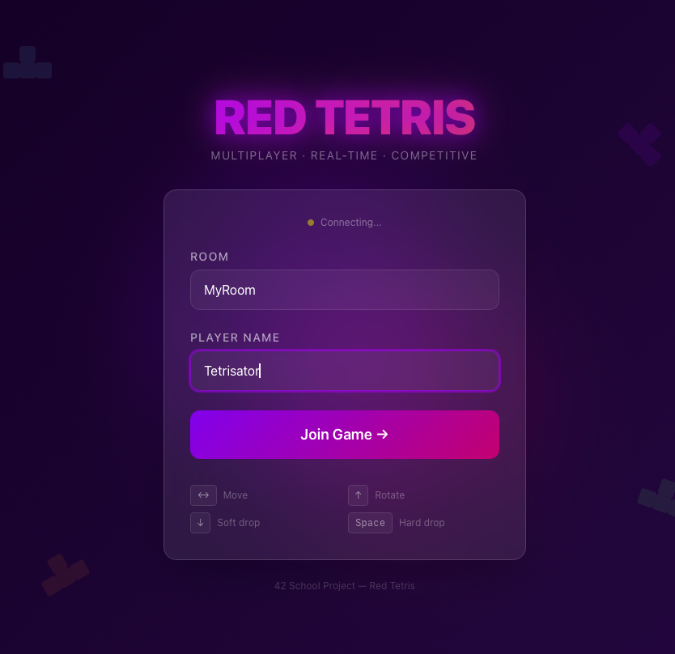

# 🎮 Red Tetris

> **Jeu Tetris Multijoueur en Temps Réel**
>
> Jouez contre d'autres joueurs dans un réseau local ou en ligne ! ⚡

---

## 🎯 Le Jeu en Action

### 🎮 Écran de Jeu Principal



*Tableau de jeu en temps réel avec gestion des pièces, visualisation du prochain tétrimino et gestion des adversaires*

### 🔐 Écran de Connexion



*Interface simple et élégante pour créer/rejoindre une room et choisir votre pseudo*

---

## 📊 Architecture du Projet

```
    ╔════════════════════════════════════════════════════════════════════╗
    ║                                                                    ║
    ║            🔴 RED TETRIS - MULTIPLAYER GAME 🎮                   ║
    ║                                                                    ║
    ║        ┌─────────────┐  Real-Time  ┌─────────────┐               ║
    ║        │   Joueur 1  │─────────────│   Joueur 2  │               ║
    ║        │   (Board)   │ ◄─ Socket ─ │   (Board)   │               ║
    ║        └─────────────┘─────────────┘─────────────┘               ║
    ║             │                            │                        ║
    ║             └─────────┬──────────────────┘                        ║
    ║                       │                                           ║
    ║                       ▼                                           ║
    ║            ┌──────────────────────┐                              ║
    ║            │  Backend Server      │                              ║
    ║            │  (Node.js/Express)   │                              ║
    ║            └──────────────────────┘                              ║
    ║                                                                    ║
    ╚════════════════════════════════════════════════════════════════════╝
```

---

## ✨ Caractéristiques

✅ **Jeu Tetris Classique**
- Plateau 10×20
- 7 tétriminos (I, O, T, S, Z, J, L)
- Chute de pièces avec gravité
- Suppression de lignes

✅ **Multijoueur en Temps Réel**
- Connexion via Socket.IO
- Visualisation des tableaux adverses
- Pénalités automatiques (lignes bloquées)
- Élimination progressive des joueurs

✅ **Interface Moderne**
- Design Glassmorphism
- Animations fluides
- Responsive (Desktop & Mobile)
- Thème sombre élégant

---

## 🚀 Démarrage Rapide

### 📋 Prérequis

- **Node.js** ≥ 18.x
- **npm** ≥ 9.x
- Un terminal/console

### 1️⃣ Cloner le Projet

```bash
# Clonez le repository
git clone <votre-repo-url>
cd red-tetris
```

### 2️⃣ Installation Backend

```bash
# Entrez dans le dossier serveur
cd server

# Installez les dépendances
npm install

# Lancez le serveur (port 3000)
npm run dev
```

**Résultat attendu :**
```
🚀 Server running on http://localhost:3000
🎮 Frontend expected at http://localhost:3001
```

### 3️⃣ Installation Frontend (dans un autre terminal)

```bash
# Entrez dans le dossier client
cd client

# Installez les dépendances
npm install

# Lancez l'application (port 3001)
npm run dev
```

**Résultat attendu :**
```
➜ Local:   http://localhost:3001
```

---

## 🎯 Utilisation

### 🏠 Page d'Accueil
1. Ouvrez `http://localhost:3001`
2. Entrez un **nom de room** (ex: "game-001")
3. Entrez votre **pseudo** (ex: "Player1")
4. Cliquez sur **"Join Game"**

### 🪑 Salle d'Attente (Lobby)
- Attendez les autres joueurs
- Le créateur de la room peut lancer le jeu
- Cliquez sur **"Start Game"** (si vous êtes l'hôte)

### 🎮 Pendant le Jeu
| Action | Touche |
|--------|--------|
| Déplacer Gauche | `←` ou `A` |
| Déplacer Droit | `→` ou `D` |
| Rotation | `↑` ou `W` |
| Chute Rapide | `↓` ou `S` |
| Chute Complète | `SPACE` |

### 🏆 Fin du Jeu
- Le dernier joueur restant gagne ! 🎉
- L'hôte peut relancer une partie

---

## 📁 Structure du Projet

```
red-tetris/
├── 📂 client/              # Frontend (Next.js + React)
│   ├── src/
│   │   ├── app/            # Pages et routes
│   │   ├── game/           # Logique du jeu
│   │   ├── store/          # Redux (État)
│   │   ├── components/     # Composants React
│   │   └── socket/         # Connexion Socket.IO
│   └── package.json
│
├── 📂 server/              # Backend (Node.js + Express)
│   ├── src/
│   │   ├── classes/        # Logique métier
│   │   ├── socket/         # Événements Socket.IO
│   │   ├── managers/       # Gestion des rooms
│   │   └── utils/          # Utilitaires
│   └── package.json
│
└── README.md               # Ce fichier !
```

---

## 🔧 Commandes Principales

### Backend (Server)

```bash
cd server

# Mode développement (hot-reload)
npm run dev

# Build production
npm run build

# Lancer la production
npm start

# Lancer les tests
npm run test

# Vérifier le code
npm run lint
```

### Frontend (Client)

```bash
cd client

# Mode développement (hot-reload)
npm run dev

# Build production
npm run build

# Lancer la production
npm start

# Tests
npm run test

# Lint
npm run lint
```

---

## 🌐 Accès à l'Application

- **Frontend** → `http://localhost:3001` 🎮
- **Backend** → `http://localhost:3000` 🔌
- **Health Check** → `curl http://localhost:3000/health`

---

## 🧪 Tester le Jeu

### Test en Local (2 joueurs)

1. **Terminal 1** - Backend
   ```bash
   cd server && npm run dev
   ```

2. **Terminal 2** - Frontend
   ```bash
   cd client && npm run dev
   ```

3. **Navigateur**
   - Ouvrez `http://localhost:3001` dans 2 onglets
   - Créez une room "test"
   - Entrez 2 pseudos différents
   - Lancez le jeu !

---

## 📚 Technologie

| Partie | Stack |
|--------|-------|
| **Frontend** | Next.js 14 • React 18 • Redux • Socket.IO • Tailwind CSS |
| **Backend** | Node.js • Express • Socket.IO • TypeScript |
| **Type-Safe** | TypeScript partout ✅ |
| **Tests** | Jest + Testing Library |

---

## ⚙️ Configuration Avancée

### Variables d'Environnement Backend

Créez un fichier `.env` dans `server/` :

```env
PORT=3000
CLIENT_URL=http://localhost:3001
NODE_ENV=development
```

### Variables d'Environnement Frontend

Créez un fichier `.env.local` dans `client/` :

```env
NEXT_PUBLIC_SERVER_URL=http://localhost:3000
```

---

## 🐛 Dépannage

### Le serveur ne démarre pas
```bash
# Vérifiez que le port 3000 est libre
lsof -i :3000

# Ou sur Windows
netstat -ano | findstr :3000
```

### Le frontend ne se connecte pas au serveur
- ✅ Vérifiez que le backend tourne sur `http://localhost:3000`
- ✅ Vérifiez la variable `NEXT_PUBLIC_SERVER_URL`

### Hot-reload ne fonctionne pas
```bash
# Supprimez les caches
rm -rf client/.next node_modules
rm -rf server/dist node_modules

# Réinstallez
npm install
npm run dev
```

---

## 📖 Documentation Complète

Pour plus de détails :
- 📘 Frontend → `client/README.md`
- 📗 Backend → `server/README.md`
- 📕 Spécification → `42_Red_Tetris.en.subject.pdf`

---

## 👨‍💻 Développement

### Ajouter une Nouvelle Fonctionnalité

1. **Créez une branche**
   ```bash
   git checkout -b feature/mon-feature
   ```

2. **Développez** (les changements se rechargeront automatiquement)

3. **Testez**
   ```bash
   npm run test
   npm run lint
   ```

4. **Commitez**
   ```bash
   git add .
   git commit -m "feat: description courte"
   ```

---

## 🎓 Projet 42 School

Cet projet suit la spécification officielle de 42 School :
- ✅ Full Stack JavaScript
- ✅ Jeu Tetris en temps réel
- ✅ Réseau multijoueur
- ✅ 70% de couverture de test

---

## 📞 Support

Des problèmes ? Vérifiez :
1. Node.js est installé → `node -v`
2. Les ports 3000 et 3001 sont libres
3. Les dépendances sont installées → `npm install`
4. Les serveurs tournent bien

---

## 📝 License

Projet 42 School © 2024

---

**Happy Gaming! 🎮🔴 Profitez bien !**
